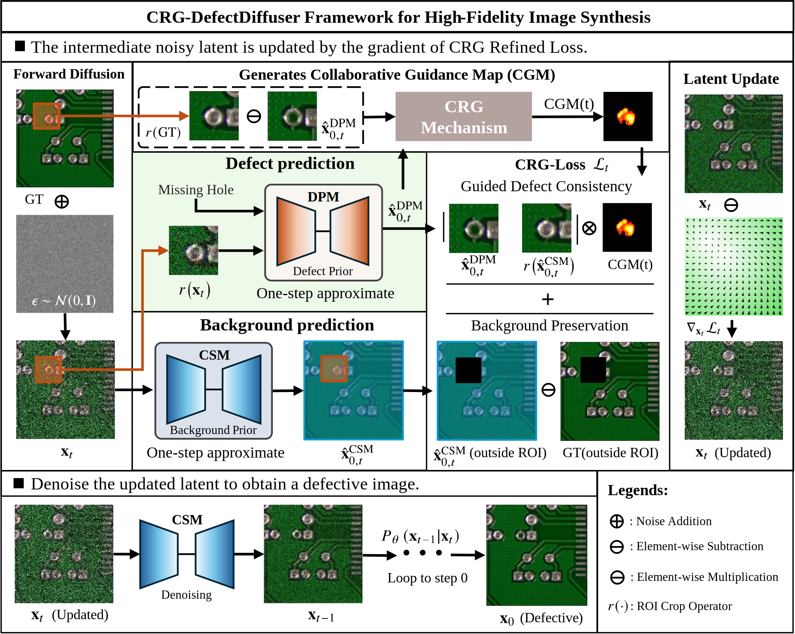
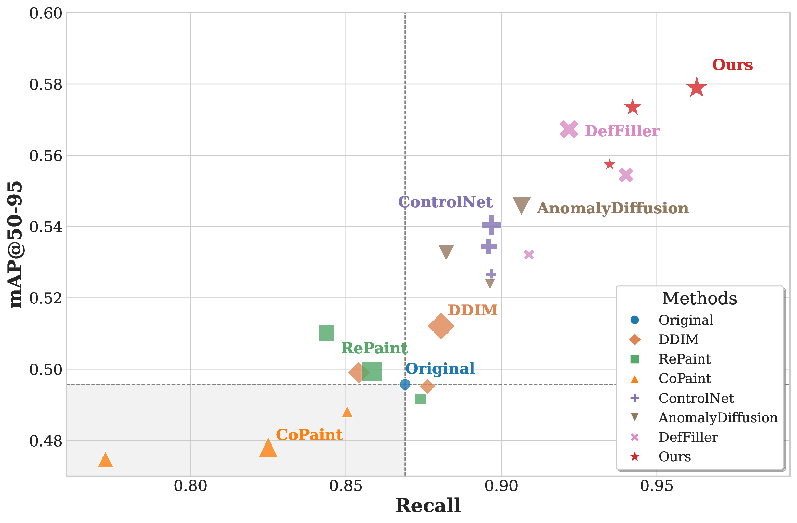

# Collaborative Refinement Guidance for High-Fidelity Defect Image Synthesis

This repository contains the official implementation of **"Collaborative Refinement Guidance for High-Fidelity Defect Image Synthesis"** submitted to *IEEE Transactions on Circuits and Systems for Video Technology (TCSVT)* journal.

---

## Overview

Developing robust deep learning models for Automated Visual Inspection (AVI) is often hindered by the scarcity and imbalance of defect training data. To address this, we propose CRG-DefectDiffuser, a collaborative generative framework for high-fidelity defect synthesis.


*Figure 1: The overall architecture of the Collaborative Refinement Guidance framework.*

Our framework's core is the Collaborative Refinement Guidance (CRG) mechanism. It orchestrates two specialized diffusion models:

- Contextual Synthesis Model (CSM): Trained on abundant defect-free images to master background context.
- Defect Prior Model (DPM): Trained on scarce defect patches to encode fine-grained defect semantics.

The CRG mechanism dynamically guides the synthesis, ensuring that morphologically accurate defects are seamlessly integrated into the appropriate background context.

Key Result: Augmenting training data with our method boosts the defect detection mAP@50-95 from a baseline of 0.496 to 0.557 (a 12.3% relative improvement).

---

## 🚀 Usage

### Clone the Repository

```bash
git clone https://github.com/xiaohang0608/CRG-Diffusion.git
cd CRG-Diffusion
```


### Pre-trained Models

You need to download the following pre-trained models and place them in the `checkpoint/` directory:


#### 1. Contextual Synthesis Mode (checkpoint-256-defect-free.pt)

This model is used for the global context.

- **Filename**: `checkpoint-256-defect-free.pt`
- **Download Link**: [Download from Google Drive](https://drive.google.com/file/d/1YlQm2ByM_s6dl8wffuiN7fVpBGVfk9dI/view?usp=drive_link)

#### 2. Defect Prior Mode (checkpoint-64-defect.pt)

This model is used for fine-grained defect analysis on patches.

- **Filename**: `checkpoint-64-defect.pt`
- **Download Link**: [Download from Google Drive](https://drive.google.com/file/d/1K7-szMOXjQRb491VB-Niaq-BMFkj9XZl/view?usp=sharing)

Place the downloaded files with the following names:
   ```
   checkpoint/
   ├── checkpoint-64-defect.pt      # Crop model (64×64)
   └── checkpoint-256-defect-free.pt # Main model (256×256)
   ```


**Note**: If you want to use your own dataset, you can train custom models based on the [OpenAI guided-diffusion](https://github.com/openai/guided-diffusion) library and adjust the corresponding configuration parameters accordingly. See `confs/train-XX.yml` for detailed configuration.


### Dataset Preparation

Our models are trained on the [PKU-Market-PCB](https://robotics.pkusz.edu.cn/resources/dataset/), which contains six defect types:

- **Missing Hole** (ID: 0)
- **Mouse Bite** (ID: 1)
- **Open Circuit** (ID: 2)
- **Short** (ID: 3)
- **Spur** (ID: 4)
- **Spurious Copper** (ID: 5)

### Data Organization

Organize your data as follows, Defect annotations use YOLO format (`.txt` files):

```
data/
├── pcb.json                    # Defect class definitions
└── sample/
    ├── defect_free_001.png     # Defect-free images
    ├── defect_free_001.txt     # Defect annotations (YOLO format)
    ├── defect_free_002.png
    ├── defect_free_002.txt
    └── ...
```

### Defect Generation

Generate PCB defect images using pre-trained models:

#### Basic Usage

```bash
python sample_generation.py --conf_path confs/pcb_gen.yml
```


#### Key Parameters (in `confs/pcb_gen.yml`)

```yaml
# Model paths
model_path: checkpoint/checkpoint-256-defect-free.pt
crop_model_path: checkpoint/checkpoint-64-defect.pt

# Input/Output
defect_free_dir: data/sample/          # Input defect-free images
outdir: ./images/                       # Output directory

# Generation settings
n_samples: 4                            # Number of samples per defect
n_iter: 1                               # Iterations per sample
seed: 42                                # Random seed (null for random)

# Attention mechanism
attention_features:
  temperature: 0.3                      # Attention sharpness (lower = sharper)
  center_weight: 1.0                    # Center region weight
  radial_decay: 0.15                    # Radial decay rate
  accumulation_beta: 0.9                # EMA coefficient

# DDIM sampling
ddim:
  num_inference_steps: 250              # Number of sampling steps
  ddim_sigma: 0.0                       # DDIM noise scale
```

#### Output Structure

```
images/
├── sample/                             # Generated defect images
│   ├── image_001_opencircuit_cx120_cy150_0.png
│   ├── image_001_opencircuit_cx120_cy150_1.png
│   └── ...
├── grid/                               # Grid visualization (multiple samples)
│   ├── image_001_opencircuit_cx120_cy150_grid.png
│   └── ...
└── log/                                # Generation logs
    └── generation.log
```

## 📈 Results

The effectiveness of CRG-DefectDiffuser is validated on challenging PCB datasets. Experimental results demonstrate significant improvement in defect detection performance when our synthetic data is incorporated into training pipelines, with the mAP@50–95 score increasing from a baseline of 0.496 to 0.557, corresponding to a relative improvement of 12.3\%. Moreover, our framework demonstrates robust scalability, consistently maintaining performance enhancements even with extensive data augmentation up to 3$\times$ the original volume.


*Figure 2: Performance trade-off between mAP@50-95 and Recall for different methods across various augmentation scales. The size of the markers is proportional to the scale factor (1x, 2x, 3x).*

---

##  Project Structure

```
CRG-Diffusion/
├── checkpoint/                      # Pre-trained model checkpoints (download separately)
│   ├── checkpoint-64-defect.pt     # Crop region generator (64×64)
│   └── checkpoint-256-defect-free.pt # Main defect-free model (256×256)
├── confs/                          # Configuration files
│   ├── pcb_gen.yml                # Generation/inference config
│   ├── train-64.yml               # Training config for 64×64 model
│   └── train-256.yml              # Training config for 256×256 model
├── data/                           # Data directory
│   ├── pcb.json                   # Defect class definitions
│   └── sample/                    # Sample defect-free images and annotations
├── guided_diffusion/               # Core diffusion model implementation
│   ├── ddim.py                    # DDIM sampling and attention mechanism
│   ├── gaussian_diffusion.py     # Gaussian diffusion base class
│   ├── unet.py                    # U-Net architecture
│   └── ...
├── utils/                          # Utility modules
│   ├── config.py                  # Configuration management
│   ├── logger.py                  # Logging utilities
│   └── ...
├── sample_generation.py            # Main generation script
├── requirements.txt                # Python dependencies
├── README.md                       # This file
└── LICENSE                         # MIT License
```

---

## 📝 Citation

If you find this work useful for your research, please consider citing:

```bibtex
@article{luo2025crg,
  title={Collaborative Refinement Guidance for High-Fidelity Defect Image Synthesis},
  author={Weihang Luo and Xingen Gao and Zhijie Zhang and Jianxiongwen Huang and Hongyi Zhang and Juqiang Lin and Hua Shi and Huanqiang Zeng},
  journal={IEEE Transactions on Circuits and Systems for Video Technology},
  year={2025},
  note={Under minor revision}
}
```

**Note:** The BibTeX entry will be updated with complete information and DOI upon paper acceptance.

---

## 🙏 Acknowledgments

This work builds upon several excellent open-source projects:

- [Improved Diffusion](https://github.com/openai/improved-diffusion) - Training framework
- [DDIM](https://github.com/ermongroup/ddim) - Sampling algorithm
- [CoPaint]( https://github.com/UCSB-NLP-Chang/CoPaint)

We thank the authors for their valuable contributions to the research community.

---

<div align="center">

**⭐ If you find this project helpful, please consider giving it a star! ⭐**

</div>
